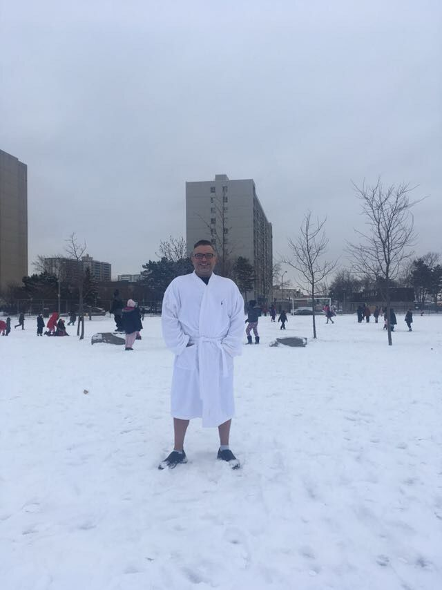

# 👤 Peter Youssef

> 📍 Born: [March 9, 1967] — [Heliopolis]  
> 🧬 Son of: [Bahaa Youssef](peter-branch.md)  
> 📘 Maintainer of this archive  

---

## 🧠 About
Teacher,
Entrepreneur, writer, and software developer.  
Founder of [Roxy Nova Systems Inc.](https://github.com/Nietzsche24-sketch)

Maintains several major Delta-grade projects:
- NovaLegal (AI legal platform)
- CarTruth (fraud detection for car repairs)
- Tachyon (memory + sync OS)
- ProfileMe (psychological profiler)
- NovaMD (healthcare front-office automation)

---

## 🧬 Family Notes

- Grandson of [Youssef (Amin)](youssef-patriarch.md)  
- Related to [Nabila](nabila-branch.md), etc.  
- Son of [Bahaa Youssef](peter-branch.md)

---

## 📷 Photos

➡️ See [Peter’s photo collection](../photos/peter-youssef/)

---

## 🎙️ Oral Histories

➡️ See [Peter’s interview log](../oral-histories/peter/)

---

## 🔐 Archive Maintainer Notes

Peter is the architect and steward of the digital Youssef Family Archive.  
He maintains the GitHub repo and future contributors.

---

_Last updated: {{ date }}_
---

## 📷 Photos

### Childhood

